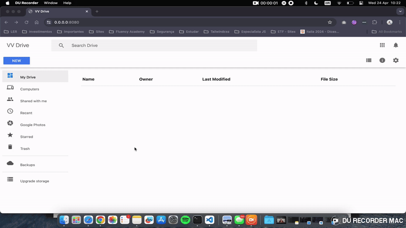

# Vítor Soares Vian 🧑🏼‍💻

###  Hi there 👋! Welcome to my :octocat: profile

- 💻 I’m currently working on Tech Lead at [CAF](https://www.caf.io/)
- 🚀 I am always looking to improve my knowledge in: Javascript, NodeJS, React and AWS.
- 🌱 At my free time I like to read tech books and write some code to improve my skills.
- 📫 How to reach me : [GMAIL](mailto:vitorsoaresvian@gmail.com)
- ⚡ Passionate about technologies.
- 😄 Fun fact:
  - I like Italian culture and I'm learning Italian
  - I like investing and related subjects 
  - I'm a PS5 player :)

###  Projects

## [VV-Drive](https://github.com/vitorvsv/vv-drive)

### Preview

### Description
The objective of this project was to clone the Google Drive file upload feature with a focus on processing pieces of the uploaded file using Node Streams.

### How does this project help my daily life?
With this project I learned how to process data on demand in the backend, which allows me to process large amounts of data using few computational resources, saving money for my company.

### Key Learnings
* NodeJS Streams
* TDD
* JS with as few libraries as possible / use of libraries with clear purposes
* Test coverage
* JS concepts like: generator functions, streams and pipelines

### How did/will I generate value for my company with this knowledge?
Problem: In my current company we have a script that queries executions that are stuck (after some supplier unavailability) in the database and reprocesses them. The problem is that the greater the number of executions to be processed, the slower the process and the greater the computational cost required to process.

Possible solution: Using the concepts learned in this project, with nodejs streams we are able to process the database data on demand and separate this processing into small parts of fixed records, thus optimizing the costs related to the reprocessing of these executions and no longer requiring high power temporary computational (extra cost).