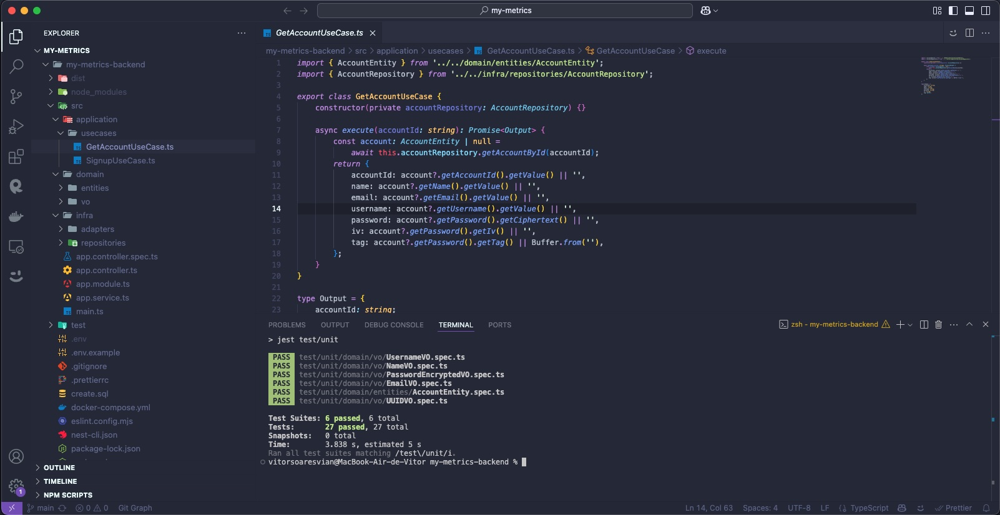
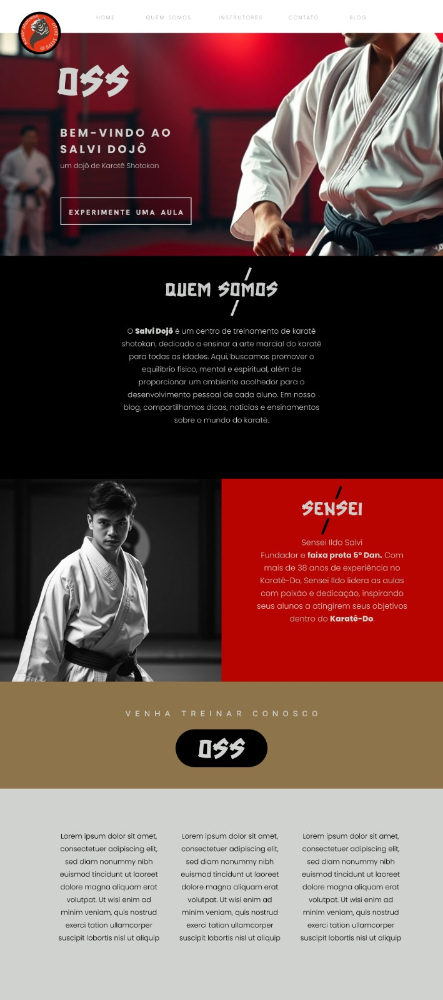

# Vítor Soares Vian 🧑🏼‍💻

###  Hi there 👋! Welcome to my :octocat: profile

- ⚡ Passionate about technologies.
- 💻 My last job was working as Tech Lead at [CAF](https://www.caf.io/)
- 🚀 I am always looking to improve my knowledge in:
  - Typescript/NodeJS
  - React
  - AWS
  - Design and architecture of software
  - and many more...
- 🌱 At my free time I like to read tech books and write some code to improve my skills.
- 📫 How to reach me : [GMAIL](mailto:vitorsoaresvian@gmail.com)
- 😄 Fun fact:
  - I like Italian culture and I'm learning Italian
  - I like investing and related subjects
  - I practice karate
  - I have a beautiful cat named "Moana" and she is a dwarf cat of the breed [minuet](https://en.wikipedia.org/wiki/Minuet_cat) 🐈

###  Projects

To be more easy to find my projects, I organized a couple of them in the list below with a short description of each project and how it contributed to the company that I'm working with. Feel free to check them out and let me know what you think!

## [VV-Drive](https://github.com/vitorvsv/vv-drive)

### Preview

### Description
The objective of this project was to clone the Google Drive file upload feature with a focus on processing pieces of the uploaded file using Node Streams.

### How does this project help my daily life?
With this project I learned how to process data on demand in the backend, which allows me to process large amounts of data using few computational resources, saving money for my company.

### Key Learnings
* NodeJS Streams
* TDD
* JS with as few libraries as possible / use of libraries with clear purposes
* Test coverage
* JS concepts like: generator functions, streams and pipelines

### How did/will I generate value for my company with this knowledge?
Problem: In my current company we have a script that queries executions that are stuck (after some supplier unavailability) in the database and reprocesses them. The problem is that the greater the number of executions to be processed, the slower the process and the greater the computational cost required to process.

Possible solution: Using the concepts learned in this project, with nodejs streams we are able to process the database data on demand and separate this processing into small parts of fixed records, thus optimizing the costs related to the reprocessing of these executions and no longer requiring high power temporary computational (extra cost).

## [My Metrics](https://github.com/vitorvsv/my-metrics-backend)

### Preview

### Description
This is a project that uses NestJS to create a backend for a metrics application. The project is built using TypeScript and follows the principles of: SOLID, Clean architecture, Test-Driven Development, and Domain Driven Design. It is a project developed to be used as a study case for me, so if you have any suggestions or improvements, feel free to open an issue or a pull request.

### How does this project help my daily life?
With this project I have the oportunity to practice the concepts learned in the book "Clean Architecture" by Robert C. Martin and "Domain Driven Design" by Eric Evans. I also learned how to use NestJS and TypeScript to create a backend for a metrics application.

### Key Learnings
* Clean Architecture
* DDD
* NestJS
* TypeScript
* Docker
* SOLID
* Test-Driven Development
* Domain Driven Design
* Clean Code
* Refactoring
* Design Patterns

### How did/will I generate value for my company with this knowledge?
Using concepts learned in this project, I can create a backend application with complex business rules and validations, using the best practices of software development. Mantaining the code clean and organized, making it easier to maintain and evolve over time.

## [Salvi Dojô](https://www.salvidojo.com.br)

### Preview

### Description
This project was a website donated to Salvi Dojo, a Shotokan Karate dojo located in Lajeado, RS that trains people of all ages and both sexes. Karate generates positive impacts on society by forming the character of its practitioners by combining the training of the body, mind and spirit.

### How does this project help my daily life?
As it is a donation to a project that I believe in, that Karate shapes the character of its practitioners, this project has a high sentimental value for me, helping to spread and grow the practice of martial arts in the city where I live.

### Key Learnings
* Delivering value in a short time: the website was delivered in less than a week
* Focus on generating value: The website was created with the features that deliver the greatest value at the moment
* Work with design: The website was designed by a fellow designer who also donated without work to the cause

### How did/will I generate value for my company with this knowledge?
This project taught me to focus on the customer's problem and how to generate the greatest value in the shortest possible time by focusing on solving the customer's pain, as this website was built using the Wix platform, which helped with fast delivery and focused on solving the problem regardless of the technology or tool used.
